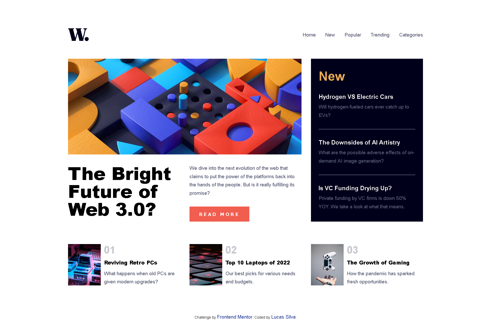

# Frontend Mentor - News-Homepage-Main

## Conteúdo

- [Overview](#overview)
  - [Desafio](#desafio)
  - [Screenshot](#screenshot)
  - [Links](#links)
- [Processo](#processo)
  - [Feito utilizando](#feito-utilizando)
- [Autor](#autor)

## Overview

Este é o resultado do desafio [News homepage challenge](https://www.frontendmentor.io/challenges/news-homepage-H6SWTa1MFl/hub/news-homepage-gwLqaA8hHH) do frontend mentor. Este desafio consiste em recriar um site realista de notícias sobre tecnologia.

Projeto ainda em construção, faltando somente incluir os eventos em javascript.

### Desafio

Os usuários devem:

- Visualizar o layout responsivo em qualquer dispositivo;

### Screenshot

### Links

- Solução: [GitHub Repo](https://github.com/lucasfs022/News-Homepage-Main)
- Live Site URL: [GitHub live site](https://lucasfs022.github.io/News-Homepage-Main/)

### Feito utilizando

- HTML5 semântico;
- CSS Grid;
- CSS custom properties;
- Flexbox;
- Javascript;
- CSS Animations.

## Autor

- Website - [Lucas Silva](https://www.lfsdev.com.br)
- Linkedin - [Lucas Silva](https://www.linkedin.com/in/lucas-silva-658980161)